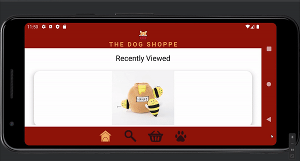

# DogShoppeApp
This is a university group project to develop a native android app that can be used to showcase/sell dog related products. (Design: Software Practice course, 2022)
### Developers: Rachel Nataatmadja and Phuvapit Mayrita Sribunwongsa 

We have been tasked to design and develop a native android app that can be used to showcase/sell products. We chose to develop a shopping app that sells products related to dog care. The name of the app is ‘The Dog Shoppe’. The purpose of this app is to make it more convenient for dog owners to get products easily without having to walk around looking for dog specific products through countless other animal products at local pet stores. When viewing the products on the app, users will be able to view items in different categories. These categories include, grooming products, food/snacks, accessories and toys. Users can also add items to wishlist and cart.

# Achievements
Our app gain first place in a class wide competition in COMPSYS 302, 2022. 
All students in this course are grouped in pairs and participated in the  competition to develop a native android app that can be used to showcase/sell some products and items. Once development is done, all teams pitch and demo their application to a panel of judges. Finalist were approached to make a mobile app promotional video for class wide voting. However, we are the only team to provide the promotional video. Hence, we got first place.

# App demo

  
 

# App Promotional Video

https://user-images.githubusercontent.com/79692362/177031407-3bfd2a2a-2eb2-4de0-b137-dd35a0e2f706.mp4

# References
Products shown in the app were used from:
- https://www.mjs.net.nz
- https://www.sundaypaws.co.nz
- https://smackbang.co.nz
- https://www.animates.co.nz
